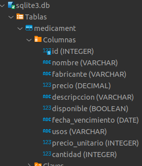

# 💊 Pharma Vendor Chatbot

Pharma Vendor Chatbot es un asistente conversacional desarrollado con [LangChain](https://www.langchain.com/) y el modelo `gemini-2.0-flash` de Google. Simula a un vendedor de farmacia capaz de:

- Ofrecer información sobre medicamentos disponibles.
- Realizar ventas conversacionales.
- Solicitar datos del cliente (nombre y dirección).
- Registrar la venta y actualizar la base de datos.
- Exportar el inventario a un archivo JSON.

---

## 🧠 Tecnologías utilizadas

- **Python 3.10+**
- **SQLite3** como base de datos local.
- **LangChain** para la orquestación del agente.
- **Google Gemini 2.0 Flash** como modelo de lenguaje.
- **LangGraph** (`MemorySaver`, `create_react_agent`) para manejo de memoria y flujo de conversación.

---

## 📁 Estructura del proyecto

# 💊 Pharma Vendor Chatbot

Pharma Vendor Chatbot es un asistente conversacional desarrollado con [LangChain](https://www.langchain.com/) y el modelo `gemini-2.0-flash` de Google. Simula a un vendedor de farmacia capaz de:

- Ofrecer información sobre medicamentos disponibles.
- Realizar ventas conversacionales.
- Solicitar datos del cliente (nombre y dirección).
- Registrar la venta y actualizar la base de datos.
- Exportar el inventario a un archivo JSON.

---

## 🧠 Tecnologías utilizadas

- **Python 3.10+**
- **SQLite3** como base de datos local.
- **LangChain** para la orquestación del agente.
- **Google Gemini 2.0 Flash** como modelo de lenguaje.
- **LangGraph** (`MemorySaver`, `create_react_agent`) para manejo de memoria y flujo de conversación.

---

## 📁 Estructura del proyecto

pharma_vendor_chatbot/
├── main.py # Punto de entrada principal del chatbot
├── all_tools/
│ ├── init.py
│ ├── all_tools.py # Contiene las tools: search_medicine, sale_done
│ └── update_json.py # Exporta los datos desde la DB a un archivo JSON
├── medicaments.json # Archivo generado desde la base de datos
├── sqlite3.db # Base de datos con la tabla medicament
├── README.md # Este archivo

---

## ⚙️ Requisitos

1. Python 3.10 o superior
2. Tener instalado:
   ```bash
   pip install langchain langgraph sqlite3
   ```
3. API-KEY (gemnimi o openai) instalada en el entorno

---

## 🗃️ Base de datos

La base de datos `sqlite3.db` contiene una tabla `medicament` con información sobre medicamentos, incluyendo nombre, cantidad y precio.

---

## Estructura Base de datos



## 🛠️ Funcionalidades principales

### 1. `search_medicine` (tool)

Busca medicamentos en la base de datos por nombre o palabras clave.

---

### 2. `sale_done` (tool)

Registra una venta en la base de datos, disminuye el stock y responde con un mensaje de confirmación.

---

### 3. `update_json.py`

Ejecuta una consulta SQL que extrae todos los registros de la tabla `medicament` y los guarda como JSON:

```bash
# Ejecutar manualmente
python all_tools/update_json.py
```

Uso del chatbot
python main.py

Luego, puedes interactuar con el agente escribiendo el nombre del medicamento que buscas. El chatbot:

Te ofrece información del medicamento.

Cierra la venta.

Pide tu nombre y dirección.

Devuelve un JSON con estos datos y los del medicamento.

Para salir, escribe salir.

🧪 Próximos pasos sugeridos
Agregar validación de stock antes de registrar venta.

Crear una interfaz web o chatbot visual.

Agregar autenticación de usuarios.

Hacer persistencia de ventas por cliente.

---

¿Quieres que te lo entregue como archivo `README.md` para que lo pegues directo o lo guardo como archivo en tu proyecto?
